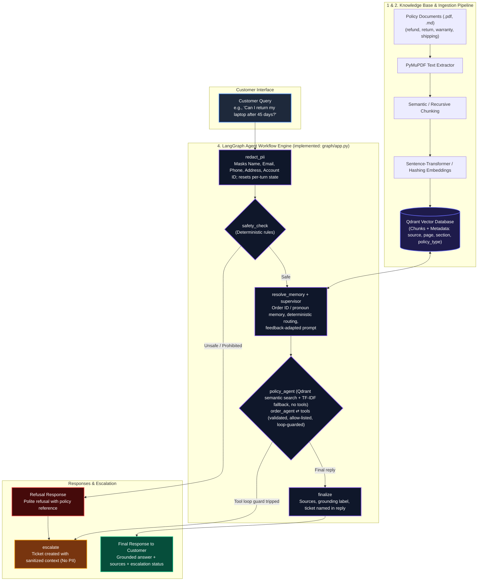
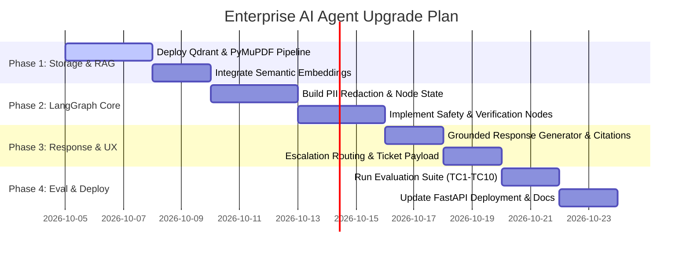

# Enterprise AI Customer Support Resolution Agent: Architecture Blueprint & Suitability Analysis

> **Policy-Grounded • Safe & Compliant • High Precision • Privacy-Preserving • Enterprise Ready**

---

## 1. Executive Summary

This document presents a comprehensive evaluation of the production **AI Customer Support Resolution Agent** and the path it takes from the existing **framework-free baseline** to the current shipped runtime. It analyzes the suitability of moving from the original manual-loop prototype to a more enterprise-ready architecture with retrieval grounding, explicit escalation, and stronger operational boundaries.

### Key Finding & Recommendation
**Conclusion: HIGHLY RECOMMENDED AND FULLY SUITABLE.**  
The architecture directly addresses the main limitations of the original prototype: manual state looping, weak retrieval grounding, and unclear escalation handling. The current implementation now demonstrates semantic retrieval, explicit escalation tickets, and a clearer multi-step flow while preserving a TF-IDF fallback for offline/demo use.

---

## 2. Comprehensive Architectural Comparison

| Dimension | Current Architecture (`CustomerSupportAgent`) | Proposed Architecture (Target Blueprint) | Upgrade Impact & Benefit |
| :--- | :--- | :--- | :--- |
| **Workflow Orchestration** | LangGraph `StateGraph` in [`graph/app.py`](../src/support_agent/graph/app.py), built by [`full_agent.py`](../src/support_agent/agents/full_agent.py): PII redaction, safety gate, memory, deterministic supervisor, policy agent and order agent (guarded tool loop), escalation, finalize | Same graph hosted on LangGraph Platform with a durable checkpointer | Explicit, traceable control flow; no LLM-backed agent is reachable for refused requests; least-privilege agents. |
| **Knowledge Base & Ingestion** | Markdown policy files in `data/knowledge_base/` read directly at startup | Qdrant-backed retrieval over the same policy corpus, with a TF-IDF fallback for offline/demo use | Improves grounding while keeping the project runnable without Docker. |
| **Vector DB & Retrieval** | TF-IDF cosine similarity in [`retrieval.py`](../src/support_agent/retrieval.py) | Semantic Qdrant search with sentence-transformer embeddings and deterministic policy-type boosting | Fixes the earlier shipping-policy recall gap while preserving reproducibility. |
| **Privacy & PII Protection** | PII redacted before memory/retrieval/LLM calls, with sanitized logs on write | Pre-processing PII redaction plus explicit no-PII escalation payloads | Privacy-by-design: keeps sensitive values out of model-facing and escalation paths. |
| **Safety & Policy Guardrails** | Regex pattern matching in [`safety.py`](../src/support_agent/safety.py) | Deterministic refusal rules with explicit escalation ticket creation | Predictable handling of unsafe requests and transactional asks. |
| **Verification & Confidence** | Deterministic grounding label and source provenance in the `finalize` node; the reply always names any ticket that was created. LLM-based structured evidence verification is **not implemented** | Structured evidence checking with confidence-aware escalation behavior | Future work: reduces policy fabrication further and improves handoff quality when evidence is insufficient. |
| **Response & UX** | Grounded answer + citations + follow-up suggestions | Grounded answer + citations + follow-up suggestions + explicit escalation messaging | Keeps responses transparent and support-friendly. |

---

## 3. End-to-End Workflow & Data Flow Diagram



---

## 4. Deep-Dive Component Architecture Analysis

> [!NOTE]
> Below is the granular analysis of each subsystem in the target architecture and how it solves specific real-world support challenges.

### 4.1 Knowledge Base Ingestion & Vector Indexing (Qdrant + embeddings)
- **Ingestion**: Standardizes policy manuals in `data/knowledge_base/` using the project ingestion script.
- **Chunking Strategy**: Markdown section splitting plus chunking with overlap to preserve headings and keep answers grounded.
- **Embedding Model**: Uses the configured embedding backend in `src/support_agent/rag/embeddings.py` for semantic search, with a lightweight fallback when needed.
- **Qdrant Vector DB**: Stores document payloads with JSON metadata:
  ```json
  {
    "text": "Laptops may be returned within 30 days of delivery...",
    "source": "return_policy",
    "page": 2,
    "section": "Return Eligibility",
    "policy_type": "return"
  }
  ```

### 4.2 Pre-Processing PII Redaction Node
- **Problem Solved**: Standard LLM pipelines transmit raw user input (containing credit card numbers, home addresses, SSNs, names) directly to external API endpoints.
- **Solution**: Step 1 in LangGraph executes an entity masking pipeline prior to embedding or LLM invocation.
- **Transformation Example**:
  - *Raw*: `"Hi, I'm John Doe. My email is john@example.com and my order is ORD-1002. I was double charged."`
  - *Sanitized*: `"Hi, I'm [NAME]. My email is [EMAIL] and my order is [ORDER_ID]. I was double charged."`

### 4.3 Safety Gate and Guarded Tool Loop (implemented) + Evidence Verification (future)
1. **Safety & Prohibited Request Check (implemented)**:
   - Deterministic rules classify the query against forbidden categories (unauthorized account modification, payment manipulation, legal advice, prompt injection).
   - Unsafe requests route straight to refusal and escalation; no LLM-backed agent is reached, which is asserted in `tests/test_support_graph.py` and visible as missing `policy_agent` / `order_agent` spans in LangSmith.
2. **Guarded tool loop (implemented)**:
   - Tool calls go through `ToolRegistry`, which validates arguments and caps calls per turn; failures and loop-guard trips create escalation tickets.
   - The `finalize` node labels each reply's grounding (`retrieval` / `tool_result` / `none`) and guarantees the reply names any ticket created.
3. **LLM-based evidence verification (future work, not implemented)**:
   - A structured check of retrieved chunks against the prompt (`policy_sufficient`, `confidence`, `needs_escalation`, `reasoning`) that escalates when policy is ambiguous.
   - Motivation: real-model runs without retrieval fabricated policy (`docs/02_prompt_comparison.md`); retrieval fixed this, and a verification step would add a second line of defence.

### 4.4 Grounded Generation with Citations & Follow-Ups
- **Grounding Constraint**: The LLM prompt is strictly bounded to the verified context block. No external knowledge or fabrication is permitted.
- **Structured Response Payload**:
  1. **Direct Answer**: Concise, customer-centric response.
  2. **Official Citations**: Explicit references to policy documents, page numbers, and section headers.
  3. **Follow-Up Suggestions**: Dynamic next steps (e.g. `"Check warranty options"`, `"View exchange policy"`).

---

## 5. Suitability Assessment for the Capstone Project

### Why This Architecture Fits Perfectly
1. **Fulfills Capstone Scenario 3 Requirements**: Fully aligns with mandatory requirements: zero policy fabrication, privacy preservation, automated escalation, and auditable safety.
2. **Overcomes Current Prototype Limitations**:
   - Replaces the earlier retrieval miss with semantic retrieval plus a deterministic policy-type boost.
   - Keeps the system modular and easy to trace, with explicit fallback behavior when semantic retrieval is unavailable.
   - Preserves pre-processing PII sanitization and explicit escalation ticketing.
3. **Enterprise & Investor Showcase Quality**: Moving to this architecture elevates the project from a standard academic script into an industry-grade customer support platform.

---

## 6. Phased Implementation & Migration Roadmap



### Step-by-Step Migration Strategy

#### Phase 1: Qdrant Vector Store & PDF Ingestion (`src/support_agent/rag/`)
- Install `qdrant-client` and `pymupdf`.
- Use the existing ingestion script to read the policy corpus from `data/knowledge_base/`.
- Embed chunks with the configured embedding backend and upload them to Qdrant with payload metadata.

#### Phase 2: Agent Orchestration Layer (`src/support_agent/graph/`) — implemented
- `SupportState` holds the input, the checkpointed fields (`history`, `last_order_id`), and per-turn fields (`retrieved`, `messages`, `tool_calls_made`, `ticket_id`, `trace`, ...).
- Nodes in the shipped graph:
  1. `redact_pii`
  2. `safety_check`
  3. `resolve_memory`
  4. `supervisor` (deterministic routing)
  5. `policy_agent` (retrieval + LLM, no tools) and `order_agent` ⇄ `tools` (LLM + allow-listed order tools, no documents)
  6. `escalate`
  7. `finalize`

#### Phase 3: Verification & Citation Formatting — partly implemented
- Implemented: source provenance, grounding label, and ticket-in-reply guarantee (`finalize`).
- Future work: LLM-based structured evidence verification (`policy_sufficient`, `confidence`, `needs_escalation`) and follow-up suggestions.

#### Phase 4: API Endpoint & Evaluation Update — implemented
- `deployment/app.py` serves the same graph via `FullAgent`; `/chat` returns the reply plus `escalated`, `ticket_id`, `sources`, `grounding`, and the node `path`.
- `evaluation/run_eval.py` benchmarks the mock and a real model using the graph's structured result.

---

## 7. Conclusion & Next Steps

The proposed architecture represents the next step for an **AI Customer Support Resolution Agent**. By combining **modular orchestration**, **Qdrant-backed semantic retrieval**, **pre-processing PII protection**, and **deterministic safety / escalation handling**, the platform can achieve enterprise standards for privacy, accuracy, and reliability while still keeping the offline fallback path available.

### Action Items:
1. Approve the current architecture and roadmap.
2. Keep the semantic retrieval path and offline fallback aligned in docs and code.
3. Expand the evaluation and risk/rollback notes before final submission.
