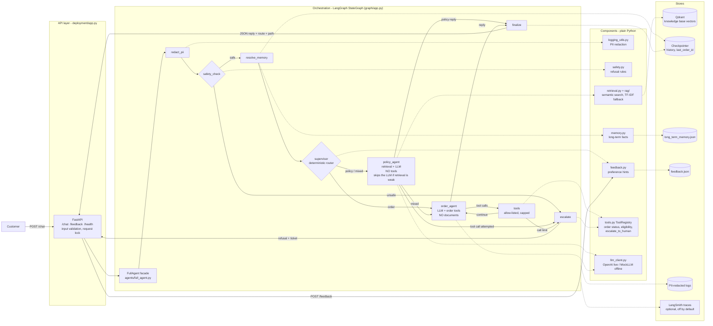
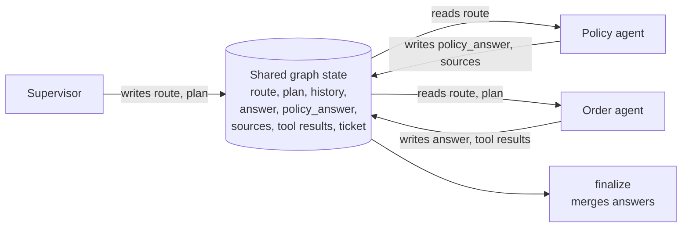
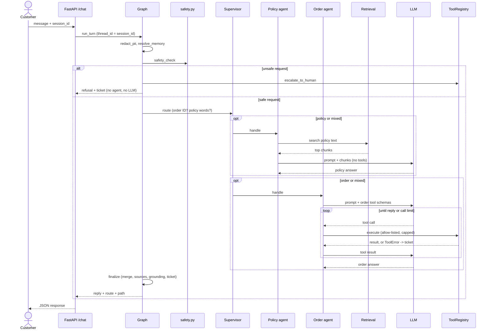

# Component Architecture

The system is a **small multi-agent design inside one LangGraph workflow**: a deterministic
**supervisor** hands each request to a **policy agent** (retrieval + LLM, no tools), an
**order agent** (LLM + order tools, no policy documents), or both. Agents never call each
other; they communicate only through shared graph state. Components are plain Python modules
that the graph nodes call. (The `agents/` folder is a separate class chain
`LLMAgent -> RagAgent -> ToolAgent -> FullAgent` showing how the system was built in phases.)

## 1. Component view

## 2. How the agents communicate

| Request | `route` | Path through the graph |
|---|---|---|
| "What is your return policy?" | policy | supervisor, policy_agent, finalize |
| "Is order ORD-1002 eligible for a return?" | order | supervisor, order_agent, tools, order_agent, finalize |
| "What is your return policy for order ORD-1002?" | both | supervisor, policy_agent, order_agent, tools, order_agent, finalize (answers merged) |
| "Please process a refund for me right now." | none | safety_check, escalate (no agent runs) |

## 3. One turn in sequence

## 4. Why this shape

- **Least privilege.** The policy agent cannot call tools or see orders; the order agent cannot see
  policy documents. `ToolRegistry.execute(..., allowed=...)` enforces this in code, and a tool call
  from the policy agent escalates to a human.
- **Deterministic supervisor.** Two rules, no LLM call, unit-tested. An LLM router would add latency,
  cost and a misrouting failure mode to the safety-relevant path.
- **Cost.** Single-domain turns use one LLM call. Mixed turns use two.
- **Limit.** Routing keys on an order ID, so an order question with no ID goes to the policy agent,
  which will say it has no documentation and offer a human.
