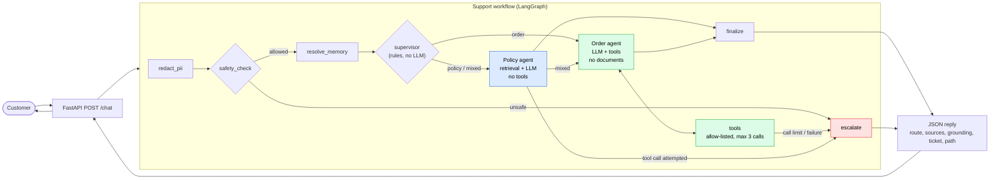
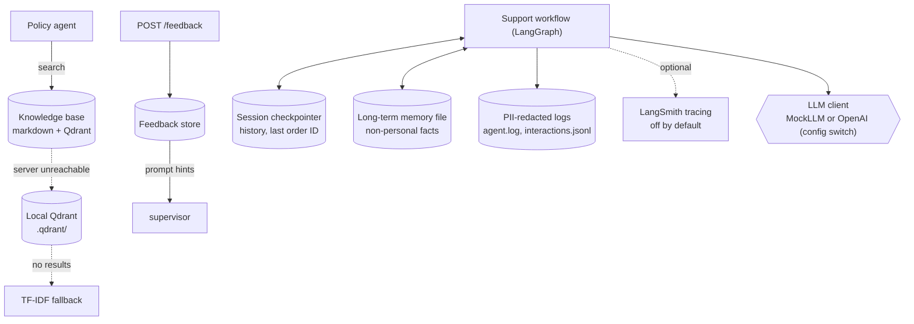
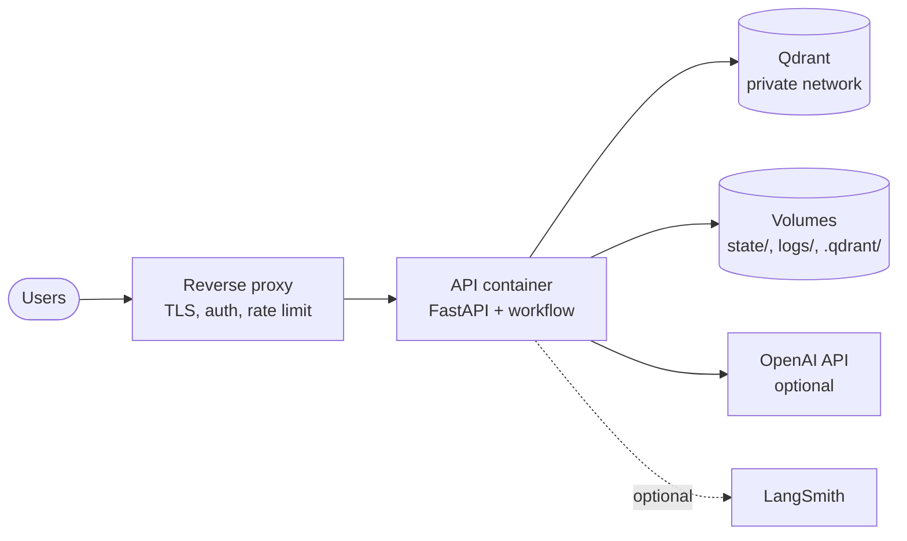

# CTO Architecture Diagram Prompt

Use the prompt below in ChatGPT to generate a clean architecture diagram for the
Customer Support Agent project presentation.

---

## Prompt to paste into ChatGPT

Create a polished **architecture diagram** for a customer support AI system that I can present to a CTO.

### The most important rule
This system has **exactly ONE request flow** with **one branch point**. Draw **one** main left-to-right pipeline.
- Do **not** draw the FastAPI backend and the agents as separate flows.
- The two specialist agents are **two boxes inside the same workflow container**, drawn as a fork after the supervisor and a merge before the final step. They are **not** two separate pipelines.
- The "offline" vs "live" LLM choice is a **configuration switch** on the LLM, not a separate path.
- "Semantic retrieval with TF-IDF fallback" happens **inside the policy agent box**.
- "Human escalation" is **one box** reached from several earlier steps.

### Context
An AI Support Resolution Agent for retail customer support: policy Q&A (returns, shipping, warranty),
order status and return-eligibility checks, safety refusal of risky requests, and escalation to a human.
A customer message goes through one LangGraph workflow served by a FastAPI endpoint. A deterministic
supervisor routes each request to a **policy agent** or an **order agent** (or both for mixed questions).

### The single flow (draw these boxes in this order, left to right)

1. **Customer** sends a message to
2. **FastAPI `POST /chat`** (validates input, passes `session_id` and message to the workflow), which runs the
3. **Support workflow (LangGraph)** — draw this as ONE large container with these steps inside, in order:
   1. **redact_pii** — masks names, emails, cards, addresses before anything else sees the text
   2. **safety_check** — deterministic refusal rules. **Branch:** if unsafe, go straight to **escalate** (no agent and no LLM runs)
   3. **resolve_memory** — recalls the last order ID and resolves "that order" / "it" (reads the session checkpointer)
   4. **supervisor** — deterministic router (rules, no LLM). Forks to one or both of:
      - **Policy agent** — retrieves policy text (Qdrant semantic search, TF-IDF fallback) and answers with the LLM. **Has no tools and no order data.** If retrieval is weak (below a relevance threshold) it answers "I don't have documentation" **without calling the LLM**, and it cites only relevant documents
      - **Order agent** — LLM plus order tools. **Has no policy documents.** It loops with the **tools** box: order status lookup, return-eligibility check, escalation-ticket creation (arguments validated, allow-listed per agent, maximum 3 calls per turn). If the call limit is hit, go to **escalate**
      - For a mixed question the policy agent runs first, then the order agent
   5. **finalize** — merges the agents' answers, adds source names, labels how the answer is grounded (retrieval, tool result, both, or none), and makes sure any ticket ID appears in the reply
   - **escalate** (one box, reached from safety_check, the tool-call limit, tool failures, and any attempted tool call by the policy agent) — creates a human-handoff ticket
4. The workflow returns a **JSON response** (reply, route, escalated, ticket ID, sources, grounding, path) through FastAPI to the **Customer**.

Show that the agents **communicate only through a shared state box** (route, plan, answers, sources); the agents do not call each other.

### Supporting stores (small boxes attached to the one flow, not separate flows)
- **Knowledge base + Qdrant vector store** — read by the policy agent
- **Session checkpointer** (conversation history, last order ID) — read/written by resolve_memory and finalize
- **Long-term memory file** (non-personal facts) — read/written by resolve_memory
- **Feedback store** — written by `POST /feedback`, read by the supervisor to adapt the prompt
- **PII-redacted logs**
- **Optional LangSmith tracing** (dashed line from the workflow container; off by default)

### Visual style
- Enterprise / CTO presentation quality, clean and simple
- Strict **left-to-right** layout, one main horizontal pipeline
- Use line colors **inside** the single flow:
  - normal answer path (grey or blue)
  - safety / tool-limit refusal path (red) going to the escalate box
  - policy agent in one color, order agent in another, so the fork is easy to read
- Short labels (a few words per box)

### Output format I want
Please return:
1. a **Mermaid architecture diagram** showing the single flow above
2. a short **executive summary** for the CTO (3-4 sentences)
3. a **legend** explaining the main arrows and colors
4. a version of the diagram optimized for a slide, with shorter labels

---

## Notes for this project
- The project is implemented and runnable; the diagram must reflect the actual system.
- There is one execution path. The same workflow serves the API, the demo, the evaluation, and the CLI.
- Every node writes a session-tagged, PII-redacted log line, and retrieval/vector-store failures are logged
  rather than swallowed. Show "PII-redacted logs" as attached to the whole workflow container.
- Qdrant is reached as a server (Docker Compose) or, if unreachable, as a local on-disk store under `.qdrant/`;
  below that, retrieval falls back to TF-IDF. This is one fallback chain inside the policy agent, not extra flows.

---

## Latest architecture diagrams (reference, current implementation)

### 1. Request flow (single workflow, one fork)

### 2. Supporting stores and observability

### 3. Deployment view

