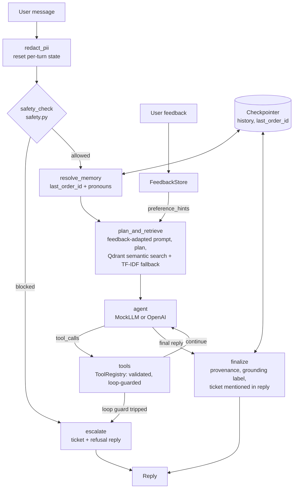

# Engineering & Product Justification

## Framework Usage: LangGraph Orchestration, Plain-Python Decisions

The agent runs as a **LangGraph `StateGraph`** (`src/capstone_agent/graph/`). LangGraph owns
*orchestration* — node sequencing, conditional routing, a checkpointer for per-session
memory, and node-level LangSmith tracing. It owns no *decisions*: every safety, tool,
retrieval, memory, and escalation rule is plain, unit-tested Python inside a node or a
routing function.

| Concern | Who owns it |
|---|---|
| Node sequencing, routing, retries/recursion limit | LangGraph (`graph/app.py`, `graph/routing.py`) |
| Short-term memory (`history`, `last_order_id`) | LangGraph checkpointer, keyed by `thread_id == session_id` |
| Tracing and run inspection | LangSmith (opt-in) |
| Safety rules, PII redaction, return-eligibility logic, tool validation, loop guard, escalation tickets | Plain Python (`safety.py`, `logging_utils.py`, `tools.py`, `graph/nodes.py`) |
| LLM calls | The project's own `llm_client` (`MockLLM` or OpenAI), called only from the `agent` node |

Why LangGraph for orchestration, and why not a heavier agent framework:
- The safety requirement is that refusal/escalation is *provably enforced*, not "mostly
  followed" by an LLM agent loop. A graph makes that structural: the `safety_check` node
  routes unsafe requests straight to `escalate`, so the LLM node is unreachable for them.
  This is asserted in `tests/test_support_graph.py` (an LLM that raises if called) and is
  visible in a trace, where refused turns have no `agent` span.
- Hand-rolled `while` loops hid the control flow. The graph makes every path explicit
  (`trace` is returned with each turn), which improves explainability and debugging.
- LangGraph's checkpointer replaces hand-written short-term memory with a documented,
  per-thread mechanism, and the same graph can be hosted on LangGraph Platform unchanged.
- We deliberately did **not** use a prebuilt ReAct agent or LangChain's chat-model/tool
  abstractions. The project's `ToolRegistry` already validates arguments and caps tool
  calls, and keeping the existing `llm_client` lets the whole system run offline with a
  deterministic mock. Fewer abstractions between the safety rules and the model.
- `agents/` still shows the phase-by-phase evolution (baseline → LLM → RAG → tools →
  full), which satisfies the assignment's "show the evolution" requirement.

Privacy note: only PII-sanitized text enters graph state, checkpoints, and traces
(redaction runs at the API/agent boundary and again in the `redact_pii` node). Traces
still leave the machine, so LangSmith tracing is off by default.

## Architecture

## Design Decisions & Tradeoffs

| Decision | Rationale | Tradeoff |
|---|---|---|
| Deterministic `MockLLM` default, real OpenAI optional | Fully offline, reproducible grading/demo without API keys; swap via `.env` (`USE_MOCK_LLM=false`) | MockLLM's tool-call heuristics (regex-based) are simpler than real function-calling reasoning — acceptable because the *agent scaffolding* (tool schemas, safety, loop guards) is identical either way. |
| Qdrant semantic retrieval with a deterministic policy-type boost, plus TF-IDF fallback | The deployed agent now needs to demonstrate end-to-end semantic retrieval while still remaining runnable in locked-down/offline environments; Qdrant gives the semantic path, while the fallback preserves reproducibility when the vector store is unavailable | The fallback path is still less semantically expressive than a fully managed vector service, but the deployed path now mirrors the submitted evidence and fixes the shipping-policy recall miss. |
| Business rules (return-eligibility, refusal/escalation) as plain, unit-tested Python | Auditable, deterministic, testable — not left to LLM judgment, which could silently drift | Less "adaptive" than an LLM deciding case-by-case; acceptable since these are exactly the decisions that must be consistent for a support agent. |
| Escalation "tool" writes a ticket record rather than integrating a real ticketing system | Keeps the project self-contained and reproducible | A real deployment would call an actual ticketing/CRM API. |
| Short-term memory = sliding window (6 turns) in the LangGraph checkpointer; long-term = small non-PII key/value facts in `ConversationMemory` | Bounded state, explicit retention rule, no risk of PII accumulation | The in-process checkpointer is lost on restart (a durable SQLite/Postgres saver is the production step); cannot recall arbitrary long-ago details — by design. |
| LangGraph for orchestration, plain Python for decisions | Safety is structural (the LLM node is unreachable for refused requests), control flow is explicit and traceable, memory uses a documented mechanism | One more dependency and a small learning curve; mitigated by keeping all business logic outside the framework so it can be tested without it. |
| Final reply must mention the escalation ticket | A real model may say "I can escalate" after a ticket was already created; the `finalize` node appends the ticket ID so the reply always matches the actual handoff state | Slightly redundant wording in some replies. |

## Safety Approach
Deterministic, regex/rule-based checks in `safety.py` run **before** any LLM call, so
refusal/escalation cannot be argued away by a prompt-injected user message. PII redaction
in `logging_utils.py` now also runs before user text is handed to memory, retrieval, or the
LLM, so sensitive content is masked at the boundary rather than only after the fact. Tool
loop-prevention (`ToolRegistry.max_calls_per_turn`) guarantees the agent can't spin
indefinitely — it always terminates in a bounded number of steps or escalates.

## Deployment Assumptions & Limitations
- Runs as a single-process FastAPI app (`deployment/app.py`) serving `FullAgent`;
  suitable for a small team or a demo deployment, not yet horizontally scaled or backed
  by a real database (state is JSON files under `state/`, and agent calls are
  serialized with a lock).
- The API exposes only `/health`, `/chat`, and `/feedback`. There is no test-runner
  endpoint, and request fields are length-validated. `/chat` returns HTTP 503 before the
  agent is ready and HTTP 500 (with a request ID) on internal failure, so monitoring can
  see errors. The API has no authentication; put it behind an API gateway or reverse
  proxy before exposing it publicly.
- Order/customer data is synthetic (`mock_data.py`); a production version would call the
  retailer's real order-management API.
- `MAX_TOOL_CALLS_PER_TURN` and `RETURN_WINDOW_DAYS` are configured in `config.py` for
  easy tuning without code changes.
- Latency/error logging is per-request via middleware. Per-node tracing is available
  through opt-in LangSmith tracing; metrics and alerting are not wired in yet — noted as a
  next step for a larger deployment.
- Real-model behaviour was verified with `gpt-4o-mini` (see `docs/03_evaluation_report.md`),
  which also surfaced two tool-protocol bugs the offline mock could not reveal.

