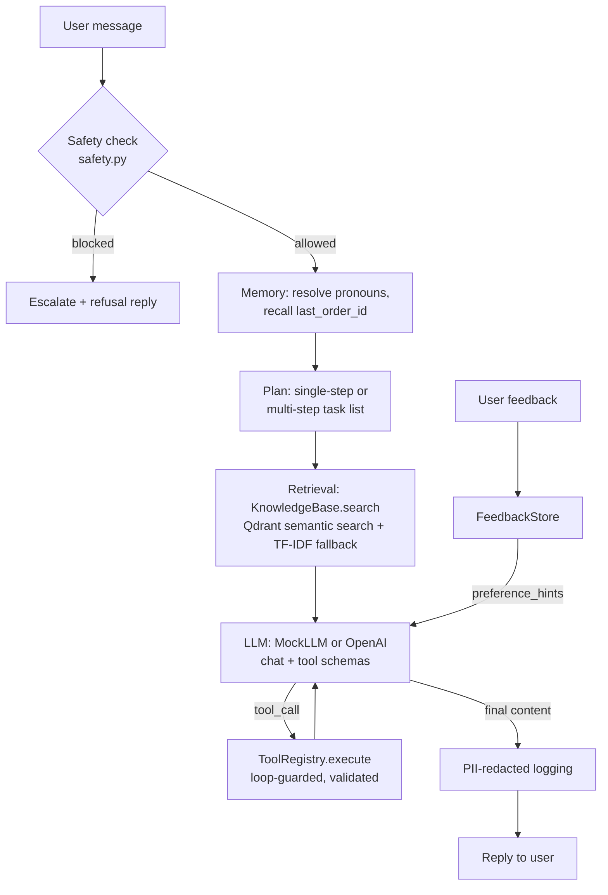

# Engineering & Product Justification

## Track Choice: Framework-Free (Track B)

No LangChain/CrewAI/Flowise was used. Justification:
- The required capabilities (prompt strategies, retrieval, tool calling, memory,
  planning, adaptation, safety) are individually simple enough that a thin, transparent
  implementation is more auditable than a framework's implicit orchestration — which
  matters directly for the safety requirements (deterministic refusal/escalation must be
  provably enforced, not "mostly followed" by an LLM agent loop).
- Equivalent capabilities are demonstrated explicitly, one phase at a time, in
  `src/capstone_agent/agents/` (`baseline_agent.py` → `llm_agent.py` → `rag_agent.py` →
  `tool_agent.py` → `full_agent.py`), which also directly satisfies the assignment's
  "show the evolution" requirement.
- Dependencies were also kept native-Python-only after an environment-specific
  constraint was discovered (see "Tradeoffs" below).

## Architecture

## Design Decisions & Tradeoffs

| Decision | Rationale | Tradeoff |
|---|---|---|
| Deterministic `MockLLM` default, real OpenAI optional | Fully offline, reproducible grading/demo without API keys; swap via `.env` (`USE_MOCK_LLM=false`) | MockLLM's tool-call heuristics (regex-based) are simpler than real function-calling reasoning — acceptable because the *agent scaffolding* (tool schemas, safety, loop guards) is identical either way. |
| Qdrant semantic retrieval with a deterministic policy-type boost, plus TF-IDF fallback | The deployed agent now needs to demonstrate end-to-end semantic retrieval while still remaining runnable in locked-down/offline environments; Qdrant gives the semantic path, while the fallback preserves reproducibility when the vector store is unavailable | The fallback path is still less semantically expressive than a fully managed vector service, but the deployed path now mirrors the submitted evidence and fixes the shipping-policy recall miss. |
| Business rules (return-eligibility, refusal/escalation) as plain, unit-tested Python | Auditable, deterministic, testable — not left to LLM judgment, which could silently drift | Less "adaptive" than an LLM deciding case-by-case; acceptable since these are exactly the decisions that must be consistent for a support agent. |
| Escalation "tool" writes a ticket record rather than integrating a real ticketing system | Keeps the project self-contained and reproducible | A real deployment would call an actual ticketing/CRM API. |
| Short-term memory = sliding window (6 turns), long-term = small non-PII key/value facts | Bounded state, explicit retention rule, no risk of PII accumulation | Cannot recall arbitrary long-ago details — by design. |

## Safety Approach
Deterministic, regex/rule-based checks in `safety.py` run **before** any LLM call, so
refusal/escalation cannot be argued away by a prompt-injected user message. PII redaction
in `logging_utils.py` now also runs before user text is handed to memory, retrieval, or the
LLM, so sensitive content is masked at the boundary rather than only after the fact. Tool
loop-prevention (`ToolRegistry.max_calls_per_turn`) guarantees the agent can't spin
indefinitely — it always terminates in a bounded number of steps or escalates.

## Deployment Assumptions & Limitations
- Runs as a single-process FastAPI app (`deployment/app.py`); suitable for a small team
  or a demo deployment, not yet horizontally scaled or backed by a real database (state
  is JSON files under `state/`).
- Order/customer data is synthetic (`mock_data.py`); a production version would call the
  retailer's real order-management API.
- `MAX_TOOL_CALLS_PER_TURN` and `RETURN_WINDOW_DAYS` are configured in `config.py` for
  easy tuning without code changes.
- Latency/error logging is per-request via middleware; no distributed tracing (e.g.
  OpenTelemetry) is wired in yet — noted as a next step for a larger deployment.
