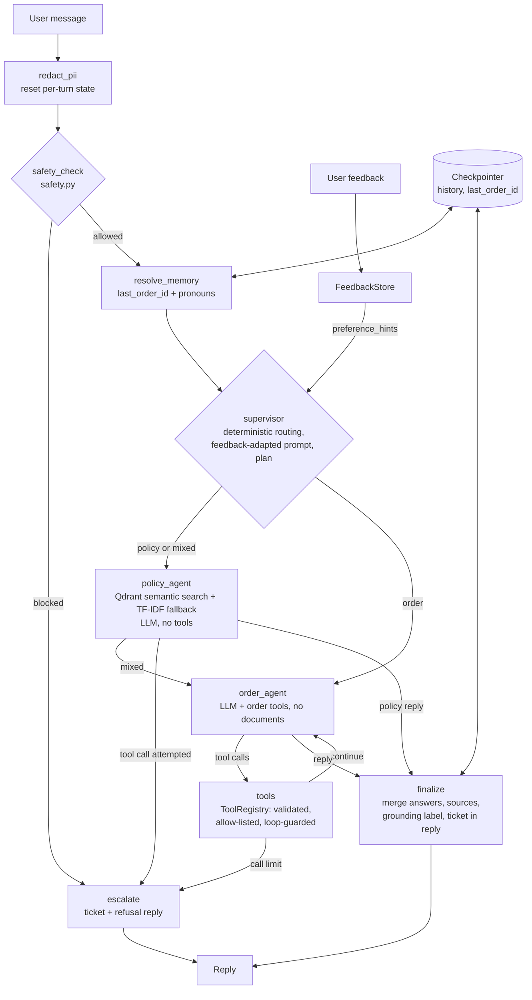

# Engineering & Product Justification

## Framework Usage: LangGraph Orchestration, Plain-Python Decisions

The agent runs as a **LangGraph `StateGraph`** (`src/capstone_agent/graph/`). LangGraph owns
*orchestration* — node sequencing, conditional routing, a checkpointer for per-session
memory, and node-level LangSmith tracing. It owns no *decisions*: every safety, tool,
retrieval, memory, and escalation rule is plain, unit-tested Python inside a node or a
routing function.

| Concern | Who owns it |
|---|---|
| Node sequencing, routing, retries/recursion limit | LangGraph (`graph/app.py`, `graph/routing.py`) |
| Short-term memory (`history`, `last_order_id`) | LangGraph checkpointer, keyed by `thread_id == session_id` |
| Tracing and run inspection | LangSmith (opt-in) |
| Safety rules, PII redaction, return-eligibility logic, tool validation, loop guard, escalation tickets | Plain Python (`safety.py`, `logging_utils.py`, `tools.py`, `graph/nodes.py`) |
| LLM calls | The project's own `llm_client` (`MockLLM` or OpenAI), called only from the policy and order agents |

Why LangGraph for orchestration, and why not a heavier agent framework:
- The safety requirement is that refusal/escalation is *provably enforced*, not "mostly
  followed" by an LLM agent loop. A graph makes that structural: the `safety_check` node
  routes unsafe requests straight to `escalate`, so neither specialist agent (the only LLM
  callers) is reachable for them.
  This is asserted in `tests/test_support_graph.py` (an LLM that raises if called) and is
  visible in a trace, where refused turns have no `policy_agent` or `order_agent` span.
- Hand-rolled `while` loops hid the control flow. The graph makes every path explicit
  (`trace` is returned with each turn), which improves explainability and debugging.
- LangGraph's checkpointer replaces hand-written short-term memory with a documented,
  per-thread mechanism, and the same graph can be hosted on LangGraph Platform unchanged.
- We deliberately did **not** use a prebuilt ReAct agent or LangChain's chat-model/tool
  abstractions. The project's `ToolRegistry` already validates arguments and caps tool
  calls, and keeping the existing `llm_client` lets the whole system run offline with a
  deterministic mock. Fewer abstractions between the safety rules and the model.
- `agents/` still shows the phase-by-phase evolution (baseline → LLM → RAG → tools →
  full), which satisfies the assignment's "show the evolution" requirement.

Privacy note: only PII-sanitized text enters graph state, checkpoints, and traces
(redaction runs at the API/agent boundary and again in the `redact_pii` node). Traces
still leave the machine, so LangSmith tracing is off by default.

## Multi-Agent Design: Supervisor, Policy Agent, Order Agent

| Agent | Responsibility | Has | Does not have |
|---|---|---|---|
| **Supervisor** (`supervisor` node) | Route the request; pick the prompt variant from feedback; build the plan | Deterministic rules, no LLM call | - |
| **Policy agent** (`policy_agent`) | Policy, shipping, warranty and FAQ answers | Retrieval (Qdrant, TF-IDF fallback) + LLM | Any tools, any order data |
| **Order agent** (`order_agent` + `tools`) | Order status and return eligibility | LLM + `get_order_status`, `check_return_eligibility`, `escalate_to_human` | Policy documents |

**Communication.** Agents never call each other. The supervisor writes `route` and `plan` to the
shared graph state; a specialist writes `answer`, `sources`, and tool results back to it; the
`finalize` node merges them. Routing: an order ID (typed, or resolved from memory such as "that
order") goes to the order agent; no order ID goes to the policy agent; an order ID plus explicit
policy wording (`policy`, `warranty`, `price match`) runs the policy agent first and then the
order agent, and the two answers are merged without another LLM call.

**Why split, and why this way.**
- *Least privilege.* The real-model runs showed a model without grounding invents policy
  (`docs/02_prompt_comparison.md`). Keeping order tools away from the policy agent, and policy
  documents away from the order agent, limits what each can get wrong. The registry rejects
  out-of-scope tool calls, and a tool call from the policy agent escalates to a human.
- *Deterministic supervisor.* An LLM router would add a call, latency and cost to every turn and
  a new failure mode (misrouting) in front of the safety-relevant path. Two cheap rules cover
  this domain and are unit-tested. The tradeoff is rigidity: a request with no order ID and
  unusual wording about orders would go to the policy agent, which would say it has no
  documentation and offer a human.
- *Cost.* Single-domain turns cost one LLM call, as before. Mixed turns cost two. The refactor
  also exposed and fixed a real-model quirk (duplicate escalation tickets in one turn).

**Known limits.** Routing keys on an order ID, so "where is my package?" with no ID goes to the
policy agent. Mixed-request replies are two independent paragraphs rather than one synthesized
answer, and with a real model the paragraphs can contradict each other in tone (for example the
policy paragraph saying it "cannot look up orders" beside the order agent's lookup). I tried
telling each agent the other covers its part; it did not reliably help and once caused an
unnecessary escalation ticket, so I reverted it. A proper fix is a short merge step (one extra
LLM call) or a single agent for mixed requests.

## Retrieval Confidence Guard and Precise Sources

The policy agent no longer hands whatever the search returned to the LLM.
- **Raw similarity, not the ranking score.** The ranking score includes a +2.0 topical boost, so
  relevance is judged on the raw (pre-boost) similarity that each chunk now carries, along with
  the backend that produced it.
- **Floors measured from data.** On this knowledge base, in-scope questions scored >= 0.34 and
  out-of-scope ones <= 0.25 (semantic), so the semantic floor is 0.30. The TF-IDF fallback is
  weaker and differently scaled (in-scope 0.12-0.46), so its floor is 0.10 and discriminates less.
  Both live in `config.MIN_RETRIEVAL_SCORE`.
- **Below the floor, the LLM is not called.** The reply is a fixed "I don't have documentation on
  that topic... I can escalate" message with `grounding=none` and no sources. This removes the
  chance of a model guessing, which the real-model runs showed it will do without grounding.
- **Above the floor, only relevant chunks are used.** Chunks scoring under 70% of the best are
  dropped from both the prompt context and the Sources line (`config.SOURCE_RELATIVE_CUTOFF`),
  so "How long does shipping take?" cites `shipping_policy` alone instead of three documents.
- **Tradeoff.** A fixed threshold can wrongly say "no documentation" for a legitimate but oddly
  phrased question; the margin is narrow (0.25 vs 0.34), so the floor should be re-measured
  whenever the knowledge base changes. The score is returned as `retrieval_score` for inspection.

## Known Safety Gap: the Gate Is Still Regex-Based

The deterministic safety gate is regex-based. On the first evaluation it caught only 2 of 10
adversarial paraphrases (0 of 8 on a second set). Two things were fixed: the rules in `safety.py`
were widened (payment reversals, "money back", cancel/approve, address changes, prompt injection,
lawyer/attorney, unauthorized charges), and a PII-redaction bug was found where the case-insensitive
name pattern erased words like "being harassed" before the gate saw them. All 18 adversarial cases
now pass, and 12 legitimate questions are tested not to be over-blocked.

That is measured coverage, not a guarantee: the cases were seen while writing the patterns, so a new
phrasing can still slip through. A missed request cannot cause an action (no tool can refund, cancel
or change an address) but reaches an LLM-backed agent and may not produce an escalation ticket. The
next step is a second-layer classifier behind the deterministic gate and a genuinely unseen test set
(`docs/03_evaluation_report.md`).

## Architecture

## Design Decisions & Tradeoffs

| Decision | Rationale | Tradeoff |
|---|---|---|
| Deterministic `MockLLM` default, real OpenAI optional | Fully offline, reproducible grading/demo without API keys; swap via `.env` (`USE_MOCK_LLM=false`) | MockLLM's tool-call heuristics (regex-based) are simpler than real function-calling reasoning — acceptable because the *agent scaffolding* (tool schemas, safety, loop guards) is identical either way. |
| Qdrant semantic retrieval with a deterministic policy-type boost, plus TF-IDF fallback | The deployed agent now needs to demonstrate end-to-end semantic retrieval while still remaining runnable in locked-down/offline environments; Qdrant gives the semantic path, while the fallback preserves reproducibility when the vector store is unavailable | The fallback path is still less semantically expressive than a fully managed vector service, but the deployed path now mirrors the submitted evidence and fixes the shipping-policy recall miss. |
| Business rules (return-eligibility, refusal/escalation) as plain, unit-tested Python | Auditable, deterministic, testable — not left to LLM judgment, which could silently drift | Less "adaptive" than an LLM deciding case-by-case; acceptable since these are exactly the decisions that must be consistent for a support agent. |
| Escalation "tool" writes a ticket record rather than integrating a real ticketing system | Keeps the project self-contained and reproducible | A real deployment would call an actual ticketing/CRM API. |
| Short-term memory = sliding window (6 turns) in the LangGraph checkpointer; long-term = small non-PII key/value facts in `ConversationMemory` | Bounded state, explicit retention rule, no risk of PII accumulation | The in-process checkpointer is lost on restart (a durable SQLite/Postgres saver is the production step); cannot recall arbitrary long-ago details — by design. |
| LangGraph for orchestration, plain Python for decisions | Safety is structural (no LLM-backed agent is reachable for refused requests), control flow is explicit and traceable, memory uses a documented mechanism | One more dependency and a small learning curve; mitigated by keeping all business logic outside the framework so it can be tested without it. |
| Policy agent + order agent behind a deterministic supervisor | Least privilege: the policy agent has no tools and no order data; the order agent has no policy documents; permissions are enforced in `ToolRegistry`, not just in prompts. Each can be prompted, evaluated, and traced separately | Mixed requests need both agents (two LLM calls, merged reply); rule-based routing is less flexible than an LLM router (see Multi-Agent Design) |
| Final reply must mention the escalation ticket | A real model may say "I can escalate" after a ticket was already created; the `finalize` node appends the ticket ID so the reply always matches the actual handoff state | Slightly redundant wording in some replies. |
| Retrieval-confidence guard + relevance-filtered Sources | Below a measured raw-similarity floor the policy agent answers "no documentation" without calling the LLM; only relevant chunks reach the prompt and the Sources line | A fixed threshold can wrongly reject an oddly phrased question; must be re-measured when the knowledge base changes (see Retrieval Confidence Guard) |

## Safety Approach
Deterministic, regex/rule-based checks in `safety.py` run **before** any LLM call, so
refusal/escalation cannot be argued away by a prompt-injected user message. PII redaction
in `logging_utils.py` now also runs before user text is handed to memory, retrieval, or the
LLM, so sensitive content is masked at the boundary rather than only after the fact. Tool
loop-prevention (`ToolRegistry.max_calls_per_turn`) guarantees the agent can't spin
indefinitely — it always terminates in a bounded number of steps or escalates.

## Deployment Assumptions & Limitations
- Runs as a single-process FastAPI app (`deployment/app.py`) serving `FullAgent`;
  suitable for a small team or a demo deployment, not yet horizontally scaled or backed
  by a real database (state is JSON files under `state/`, and agent calls are
  serialized with a lock).
- The API exposes only `/health`, `/chat`, and `/feedback`. There is no test-runner
  endpoint, and request fields are length-validated. `/chat` returns HTTP 503 before the
  agent is ready and HTTP 500 (with a request ID) on internal failure, so monitoring can
  see errors. The API has no authentication; put it behind an API gateway or reverse
  proxy before exposing it publicly.
- Order/customer data is synthetic (`mock_data.py`); a production version would call the
  retailer's real order-management API.
- `MAX_TOOL_CALLS_PER_TURN` and `RETURN_WINDOW_DAYS` are configured in `config.py` for
  easy tuning without code changes.
- Latency/error logging is per-request via middleware. Per-node tracing is available
  through opt-in LangSmith tracing; metrics and alerting are not wired in yet — noted as a
  next step for a larger deployment.
- Real-model behaviour was verified with `gpt-4o-mini` (see `docs/03_evaluation_report.md`),
  which also surfaced two tool-protocol bugs the offline mock could not reveal.

