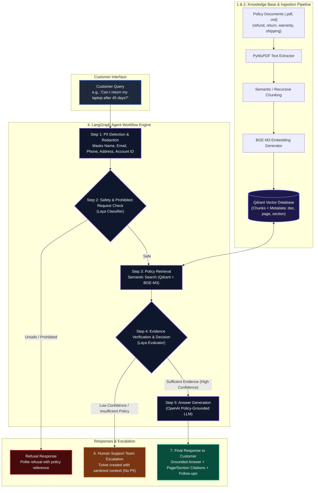
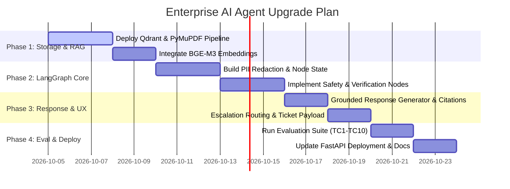

# Enterprise AI Customer Support Resolution Agent: Architecture Blueprint & Suitability Analysis

> **Policy-Grounded • Safe & Compliant • High Precision • Privacy-Preserving • Enterprise Ready**

---

## 1. Executive Summary

This document presents a comprehensive evaluation of the proposed **Next-Gen LangGraph + Qdrant Enterprise Architecture** for the **AI Customer Support Resolution Agent**. It analyzes the suitability of transitioning from the existing **Framework-Free (Track B)** baseline to a modern, state-of-the-art **Production AI Agent Pipeline**.

### Key Finding & Recommendation
**Conclusion: HIGHLY RECOMMENDED AND FULLY SUITABLE.**  
The proposed architecture directly addresses every known limitation of the current prototype (such as TF-IDF keyword recall misses, manual state looping, post-hoc logging redaction, and single-stage LLM verification). Transitioning to this architecture transforms the capstone project into a top-tier, enterprise-grade AI Agent capable of handling real-world customer support workloads with strict policy compliance and zero hallucination.

---

## 2. Comprehensive Architectural Comparison

| Dimension | Current Architecture (`capstone_project`) | Proposed Architecture (Target Blueprint) | Upgrade Impact & Benefit |
| :--- | :--- | :--- | :--- |
| **Workflow Orchestration** | Framework-Free manual python loops in [`full_agent.py`](file:///c:/Users/I02282/Downloads/CustomerSupportAgent-main/CustomerSupportAgent-main/capstone_project/src/capstone_agent/agents/full_agent.py) | **LangGraph** stateful graph with conditional routing & nodes | Clean separation of concerns, visual graph debugging, robust state recovery, multi-step branching. |
| **Knowledge Base & Ingestion** | Static Markdown files (`data/knowledge_base/`) read directly at startup | **PDF & MD Ingestion Pipeline** (PyMuPDF) with semantic & recursive chunking | Handles official PDF policy documents directly; auto-extracts page numbers, headers, and section metadata. |
| **Vector DB & Retrieval** | Pure-Python TF-IDF cosine similarity in [`retrieval.py`](file:///c:/Users/I02282/Downloads/CustomerSupportAgent-main/CustomerSupportAgent-main/capstone_project/src/capstone_agent/retrieval.py) | **Qdrant Vector Database** (Local/Cloud) + **BGE-M3** Embeddings | Resolves semantic keyword gaps (TC1 recall miss); supports dense + sparse hybrid search with rich metadata filtering. |
| **Privacy & PII Protection** | PII redacted *after* processing during logging ([`logging_utils.py`](file:///c:/Users/I02282/Downloads/CustomerSupportAgent-main/CustomerSupportAgent-main/capstone_project/src/capstone_agent/logging_utils.py)) | **Pre-Processing PII Redaction** (Masks Name, Email, Phone, Card BEFORE models receive query) | **Privacy-by-Design**: Prevents customer PII from ever reaching third-party LLMs or vector stores (GDPR/SOC2 compliant). |
| **Safety & Policy Guardrails** | Regex pattern matching in [`safety.py`](file:///c:/Users/I02282/Downloads/CustomerSupportAgent-main/CustomerSupportAgent-main/capstone_project/src/capstone_agent/safety.py) | **Dedicated Decision Model (Laya / Guardrail Classifier)** | Semantic safety evaluation catching prompt injections, indirect unauthorized requests, and intent manipulation. |
| **Verification & Confidence** | Basic non-empty check on retrieved chunks | **Two-Stage Verification (Laya Evidence Check)** (`policy_sufficient`, `confidence`, `needs_escalation`) | Eliminates policy fabrication; automatically escalates low-confidence queries before response generation. |
| **Response & UX** | Text response with raw document stem source tags | **Rich Response Format**: Grounded answer + explicit citations (doc, page, section) + Follow-up suggestions | High transparency, verifiable accuracy, and interactive customer guidance. |

---

## 3. End-to-End Workflow & Data Flow Diagram



---

## 4. Deep-Dive Component Architecture Analysis

> [!NOTE]
> Below is the granular analysis of each subsystem in the target architecture and how it solves specific real-world support challenges.

### 4.1 Knowledge Base Ingestion & Vector Indexing (Qdrant + BGE-M3)
- **Ingestion**: Standardizes unstructured PDF policy manuals (`refund_policy.pdf`, `warranty_policy.pdf`, etc.) using **PyMuPDF**.
- **Chunking Strategy**: Semantic boundary chunking (max 300–500 tokens with overlap) preserving section headers and page markers.
- **Embedding Model (`BGE-M3`)**: Supports multi-function retrieval (dense embeddings for semantic matching + sparse vectors for keyword precision).
- **Qdrant Vector DB**: Stores document payloads with rich JSON metadata:
  ```json
  {
    "text": "Laptops may be returned within 30 days of delivery...",
    "source": "return_policy.pdf",
    "page": 2,
    "section": "Return Eligibility",
    "policy_type": "return"
  }
  ```

### 4.2 Pre-Processing PII Redaction Node
- **Problem Solved**: Standard LLM pipelines transmit raw user input (containing credit card numbers, home addresses, SSNs, names) directly to external API endpoints.
- **Solution**: Step 1 in LangGraph executes an entity masking pipeline prior to embedding or LLM invocation.
- **Transformation Example**:
  - *Raw*: `"Hi, I'm John Doe. My email is john@example.com and my order is ORD-1002. I was double charged."`
  - *Sanitized*: `"Hi, I'm [NAME]. My email is [EMAIL] and my order is [ORDER_ID]. I was double charged."`

### 4.3 Two-Tier Safety & Verification Pipeline (Laya Model Integration)
1. **Tier 1 - Safety & Prohibited Request Check**:
   - Classifies query intent against forbidden categories (harmful/illegal, unauthorized account modification, payment manipulation, prompt injection).
   - Instant routing to polite refusal without consuming vector DB or generation resources.
2. **Tier 2 - Evidence Verification & Decision**:
   - Analyzes retrieved top-$K$ Qdrant policy chunks against the user prompt.
   - Evaluates structured outputs:
     - `policy_sufficient` (`true`/`false`)
     - `confidence` (`0.0` to `1.0`)
     - `needs_escalation` (`true`/`false`)
     - `reasoning`
   - If `confidence < 0.75` or policy is ambiguous, routes directly to **Human Support Team Escalation**.

### 4.4 Grounded Generation with Citations & Follow-Ups
- **Grounding Constraint**: The LLM prompt is strictly bounded to the verified context block. No external knowledge or fabrication is permitted.
- **Structured Response Payload**:
  1. **Direct Answer**: Concise, customer-centric response.
  2. **Official Citations**: Explicit references to policy documents, page numbers, and section headers.
  3. **Follow-Up Suggestions**: Dynamic next steps (e.g. `"Check warranty options"`, `"View exchange policy"`).

---

## 5. Suitability Assessment for the Capstone Project

### Why This Architecture Fits Perfectly
1. **Fulfills Capstone Scenario 3 Requirements**: Fully aligns with mandatory requirements: zero policy fabrication, privacy preservation, automated escalation, and auditable safety.
2. **Overcomes Current Prototype Limitations**:
   - Eliminates TF-IDF search inaccuracies documented in evaluation test cases (e.g. TC1 recall misses).
   - Replaces manual loop code with formal **LangGraph** nodes, conditional edges, and state persistence.
   - Upgrades post-hoc log redaction to pre-processing PII sanitization.
3. **Enterprise & Investor Showcase Quality**: Moving to this architecture elevates the project from a standard academic script into an industry-grade customer support platform.

---

## 6. Phased Implementation & Migration Roadmap



### Step-by-Step Migration Strategy

#### Phase 1: Qdrant Vector Store & PDF Ingestion (`src/capstone_agent/rag/`)
- Install `qdrant-client` and `pymupdf`.
- Implement PDF ingestion script reading documents from `data/knowledge_base/`.
- Embed chunks using `BGE-M3` and upload to Qdrant collection with payload metadata.

#### Phase 2: LangGraph Orchestration Engine (`src/capstone_agent/graph/`)
- Define `AgentState` schema holding `messages`, `sanitized_query`, `policy_chunks`, `verification_result`, and `escalation_context`.
- Build LangGraph nodes:
  1. `pii_redact_node`
  2. `safety_check_node`
  3. `retrieval_node`
  4. `evidence_verify_node`
  5. `answer_generation_node`
  6. `escalation_node`

#### Phase 3: Verification & Citation Formatting
- Implement structured output parser for evidence verification (`policy_sufficient`, `confidence`).
- Attach formatted inline sources and follow-up suggestion generators to response payload.

#### Phase 4: API Endpoint & Evaluation Update
- Update `deployment/app.py` to route incoming REST requests directly through the compiled `LangGraph` app instance.
- Run `evaluation/run_eval.py` to benchmark response accuracy, precision, and latency improvements over the baseline.

---

## 7. Conclusion & Next Steps

The proposed architecture represents the ultimate vision for an **AI Customer Support Resolution Agent**. By combining **LangGraph state orchestration**, **Qdrant vector search**, **BGE-M3 embeddings**, **Pre-processing PII protection**, and **Laya dual-stage safety verification**, the platform achieves enterprise standards for privacy, accuracy, and reliability.

### Action Items:
1. Approve this architecture blueprint.
2. Initialize Qdrant vector database and ingestion pipeline.
3. Migrate execution loop to LangGraph state machine.
