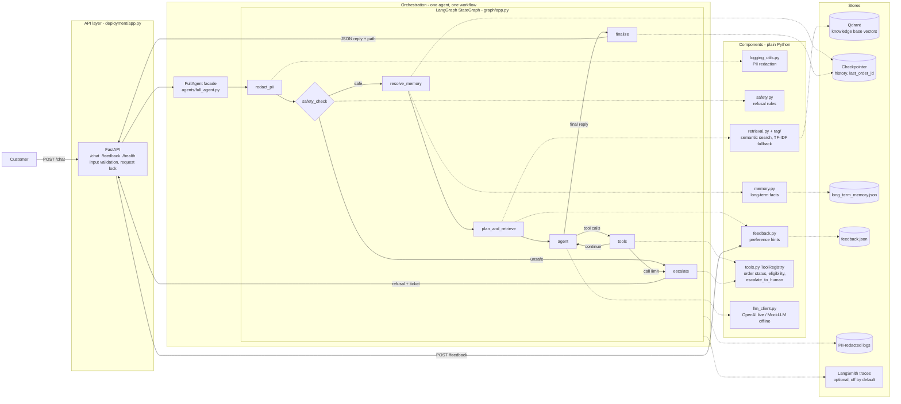
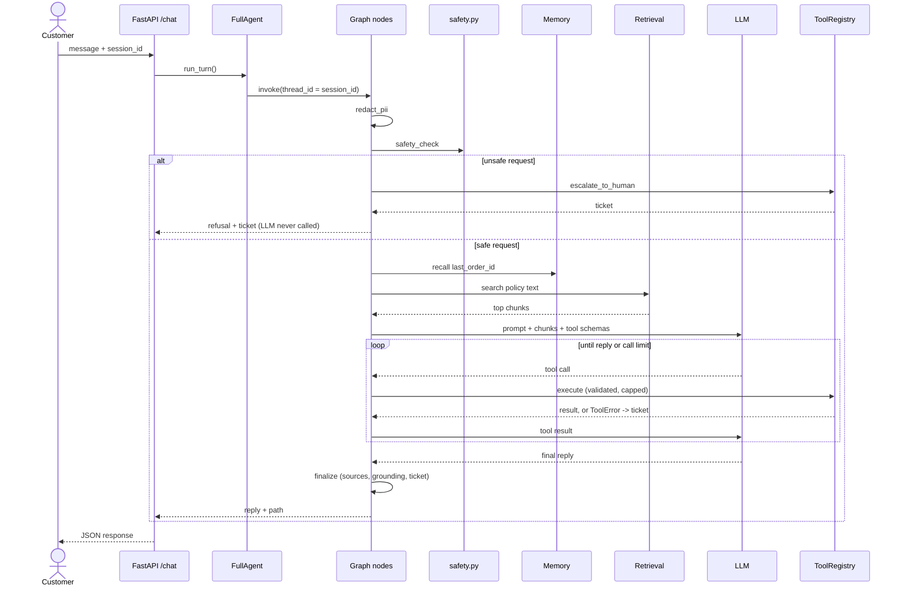
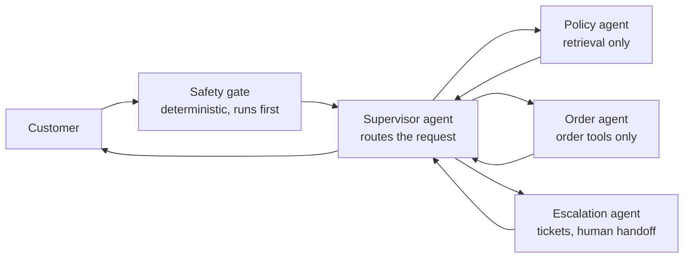

# Component Architecture

The system is **one agent** implemented as **one LangGraph workflow**. Components are plain
Python modules that the graph nodes call. The `agents/` folder is a class chain
(`LLMAgent -> RagAgent -> ToolAgent -> FullAgent`) showing how the system was built up in
phases; it is not a set of communicating agents.

## 1. Component view

## 2. How the pieces communicate in one turn

## 3. Not implemented: what a multi-agent version would look like

Shown for comparison only. The current single-agent design is deliberate: the safety gate is
structural and one workflow is easier to test and explain.

Reasons to adopt it later: separate prompts and permissions per specialist (the order agent
never sees policy text), independent evaluation, and independent scaling. Costs: more LLM
calls per turn (latency and cost), more failure modes (routing mistakes, agents disagreeing),
and a harder safety argument.
